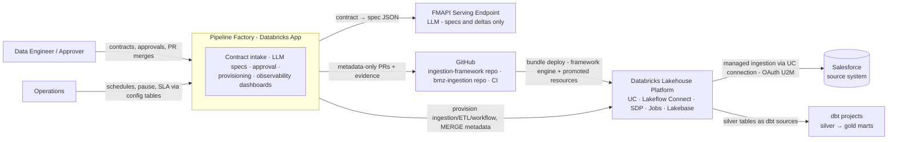
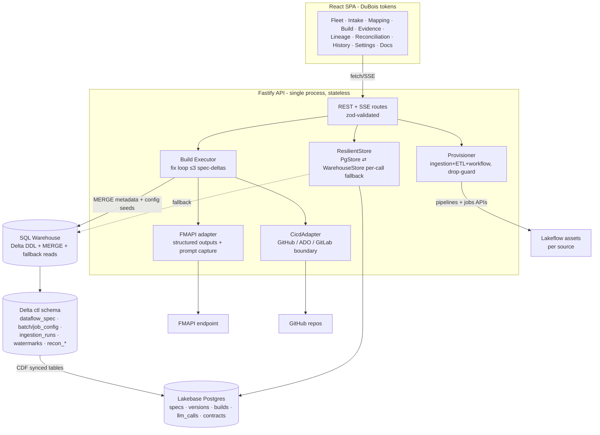
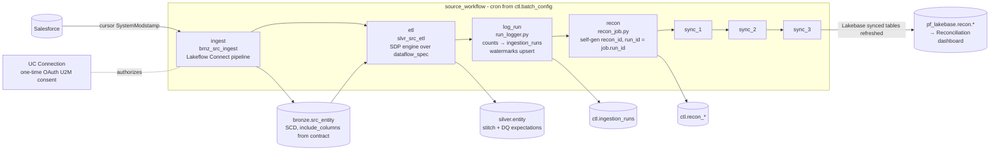
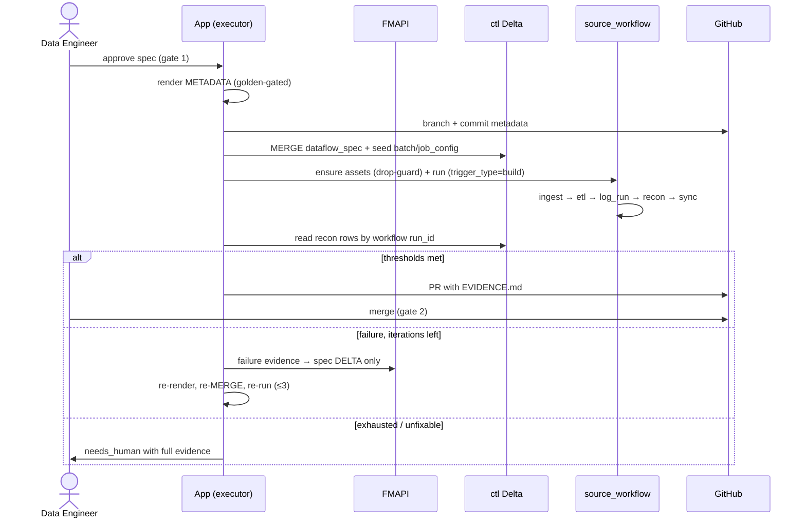
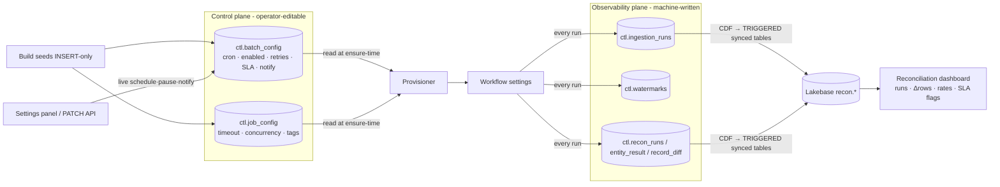
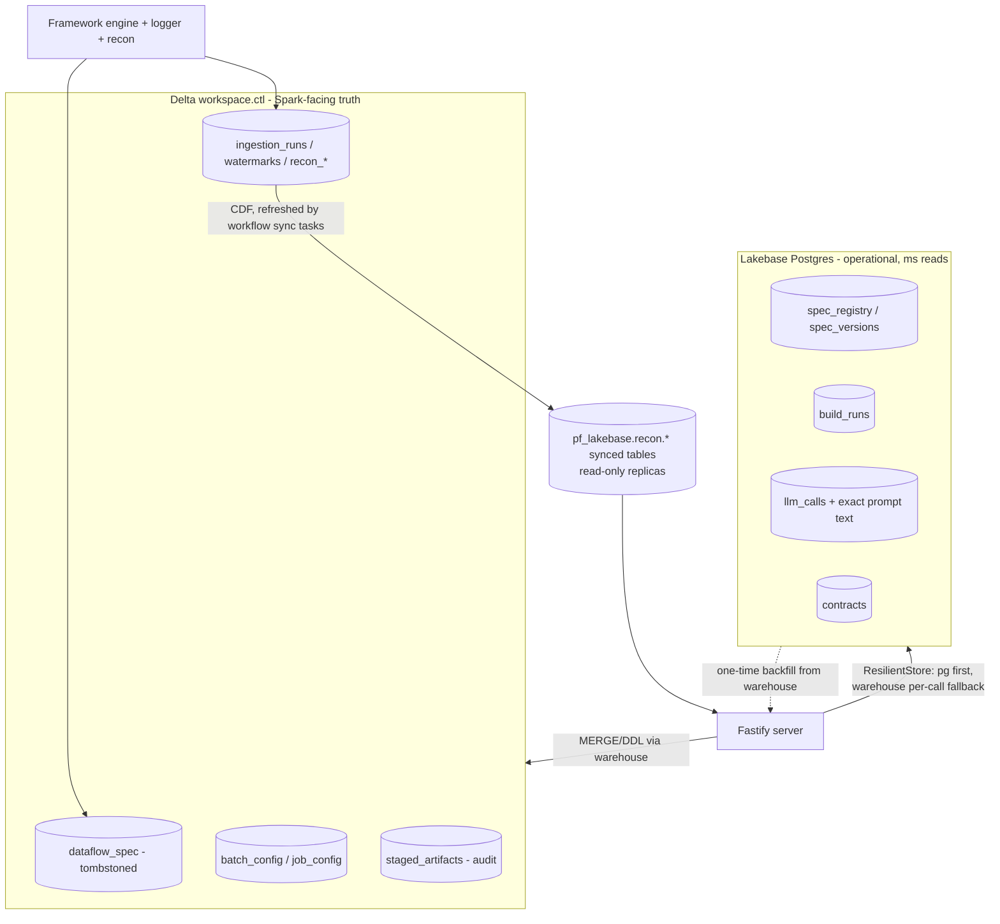

# Architecture Diagrams — Pipeline Factory (v3)

Principal-architect view of the system, layered C4-style: **L1 system context →
L2 app containers → L3 component diagrams per capability**. Mermaid sources are
authoritative and version-controlled here (rendered by GitHub); the Lucid
document mirrors them for visual editing (links in `docs/design/architecture-v2.md`).

**System overview:** Pipeline Factory turns interface contracts into governed,
reconciled ingestion pipelines. Primary users: data engineers (onboard sources,
approve specs, merge PRs) and operations (schedules, SLAs, recon dashboards).
**Key NFRs:** token-free scheduled execution (no standing credentials), dev-only
app footprint (prod = CI promotion), ms-latency app reads (Lakebase), every
generated asset traceable to its spec and its exact LLM prompt, human gates on
every irreversible step.

---

## L1 — System context (C4-1)

**Request flow (happy path):** engineer uploads contract → app validates +
discovers schema → LLM emits spec → engineer approves (gate 1) → renderer emits
metadata → MERGE to `ctl.dataflow_spec` + config seeds → provisioner ensures the
three Lakeflow assets → workflow runs (ingest → etl → log → recon → sync) → PR
with evidence → engineer merges (gate 2) → customer CI promotes.

---

## L2 — App containers (C4-2)

---

## L3.1 — Ingestion capability (workflow v3)

Every run — build-triggered (`trigger_type=build`), cron (`schedule`), or manual —
produces ingestion_runs + recon rows keyed by the same workflow `run_id`, with
zero app involvement on schedule.

---

## L3.2 — Build & fix loop (sequence)

---

## L3.3 — Observability & control plane

---

## L3.4 — Storage architecture (ADR-007)

---

## Non-functional annotations

| Concern | Mechanism |
|---|---|
| Availability | app stateless; pg outage → per-call warehouse fallback (`ResilientStore`); scheduled ingestion runs independent of the app entirely |
| Latency | Lakebase reads ≈ 0 ms server-side; dashboard on synced replicas |
| Security | zero standing tokens (workflows self-contained); creds only in secret scopes / UC connections; app SP least-privilege grants |
| Integrity | golden-file renderer gate; manifest sha256 CI gate; tombstoned metadata (no silent drops); `framework_min_version` skew fail-fast |
| Auditability | spec_id on every file/table/job; llm_calls stores exact prompts; ingestion_runs for every execution |
| Quota constraints (trial) | 1 concurrent synced-table refresh → workflow chains sync tasks sequentially |
